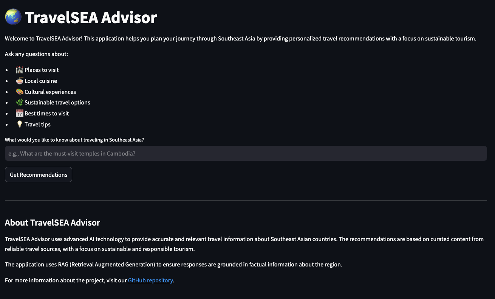
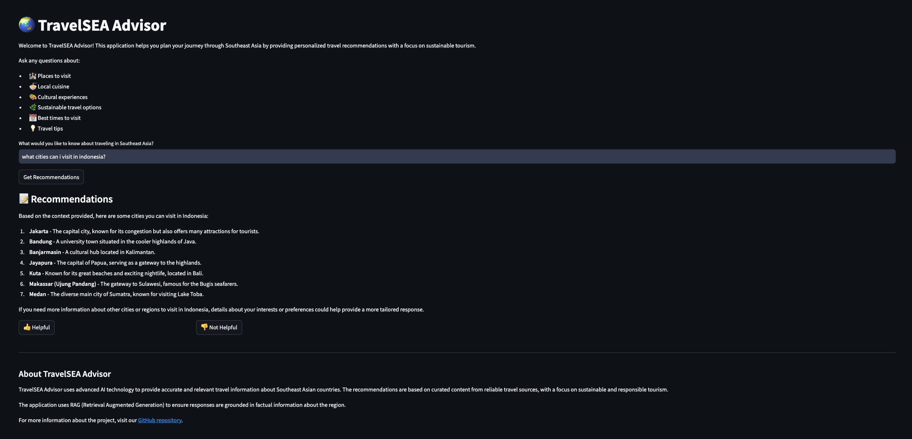
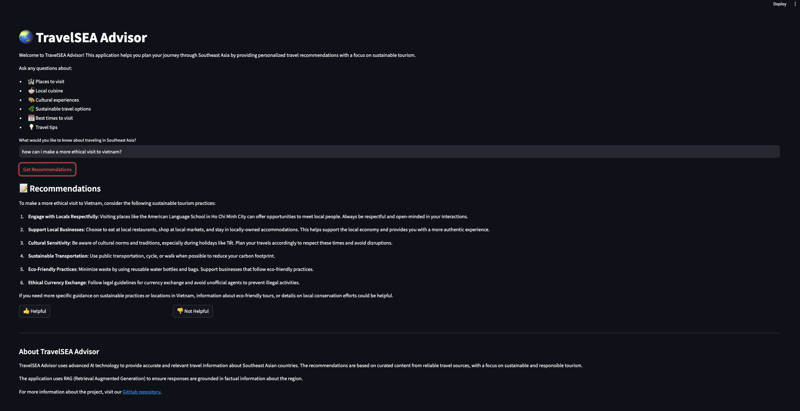
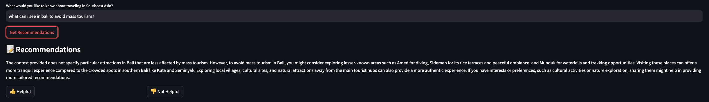

# 🌏 TravelSEA Advisor: RAG-Powered Sustainable Travel Recommendations for Southeast Asia

This repository contains the code and resources for developing a Retrieval-Augmented Generation (RAG) system that provides trip plans and tourism recommendations for Southeast Asian countries. The focus is on promoting sustainable and ethical travel practices, leveraging data from WikiVoyage and sustainability-related content.



## Table of Contents

- [Problem Statement](#problem-statement)
  - [Key Features](#key-features)
  - [Related Work](#related-work)
  - [Data Sources](#data-source)
- [Evaluation Criteria Milestones](#evaluation-criteria-milestones) (hopefully a helper for project reviewers)
  - [Problem Definition](#problem-definition)
  - [RAG Flow](#rag-flow)
  - [Retrieval Evaluation](#retrieval-evaluation)
  - [RAG Evaluation](#rag-evaluation)
  - [Interface](#interface)
  - [Ingestion Pipeline](#ingestion-pipeline)
  - [Monitoring](#monitoring)
  - [Containerization](#containerization)
  - [Reproducibility](#reproducibility)
  - [Best Practices](#best-practices)
- [Repository Structure](#repository-structure)
- [Getting Started](#getting-started)
  - [Prerequisites](#prerequisites)
  - [Installation](#installation)

## Problem Statement

In today’s travel industry, there is a growing demand for personalized and sustainable travel recommendations. This project introduces a RAG-based system that delivers contextually relevant, environmentally conscious travel suggestions specifically for Southeast Asian countries. While similar systems have been developed for major European cities, Southeast Asia, as one of the most popular holiday destinations globally, faces unique challenges.

With fewer protective laws and regulations, these countries are more vulnerable to the harmful impacts of mass tourism compared to their European counterparts. As a result, this project focuses on this region, which is particularly susceptible to the effects of climate change and overtourism.

### Key Features:
- **Customized Trip Plans:** Generates personalized travel itineraries based on user preferences, such as budget, travel style, and duration.
- **Sustainability Recommendations:** Highlights eco-friendly accommodations, local experiences, and sustainable travel tips to encourage responsible tourism.
- **Focus on Southeast Asia:** Specializes in recommendations for countries such as Thailand, Vietnam, Cambodia, Malaysia, Indonesia, and more.

### Related work:
- [Green Destination Recommender: A Web Application to
Encourage Responsible City Trip Recommendations](https://dl.acm.org/doi/pdf/10.1145/3631700.3664909)

### Data Sources
Currently, our knowledge base is built using data from Wikivoyage:
- **[WikiVoyage](https://en.wikivoyage.org/)**: A community-driven travel guide with comprehensive information on destinations, attractions, and travel tips.
- **Sustainability Pages on WikiVoyage**: Sections focused on sustainable tourism, including eco-friendly accommodations, ethical travel practices, and green transportation options.

These pages provide a good starting point for travel-related information. Considering this is a prototype version, future iterations of the project could incorporate:
- Real-time data from verified travel sources
- Curated content from local tourism boards
- Verified sustainability metrics from environmental organizations
- User-generated content with proper review mechanisms


## Evaluation Criteria Milestones

### Problem definition

The problem is explain in the top of this readme file with references to previous projects developed with a similar motivation: [Problem Statement](#problem-statement).

### RAG Flow
Notebook: [📊 RAG Flow Implementation](notebooks/04_rag_experiments.ipynb)

RAG experiments notebooks includes the implementation of a knowledge base and an LLM that together compose the RAG system.

### Retrieval Evaluation
Notebook: [📈 Retrieval Analysis](notebooks/03_evaluate_retrieval_options.ipynb)

A comprehensive comparison of different retrieval approaches was conducted:

1. MinSearch:
   - [MinSearch](https://github.com/alexeygrigorev/minsearch) is a minimal vector similarity search implementation by Alexey Grigorev

2. Chroma DB, where two embedding models were compared:
   - Model 1: multi-qa-mpnet-base-dot-v1
   - Model 2: bge-large-en-v1.5

3. PGVector with hybrid search and scalability features 

These were the chosen Evaluation Metrics:
- Hit Rate (HR)
- Mean Reciprocal Rank (MRR)

The ground truth dataset for these evaluations was create using the notebook [Generate Ground Truth](notebooks/02_generate_ground_truth.ipynb).

In the end, the chosen retrieval system was pgvector (data and discussion of the decision process can be found on the notebook).


### RAG Evaluation
Notebook: [📈 RAG Evaluation](notebooks/04_rag_experiments.ipynb)

Different RAG systems were tested, varying the complexity of the prompt given to the llm model. Please check [04_rag_experiments](notebooks/04_rag_experiments.ipynb) for more details.

### Interface

A Streamlit UI was developed to improve user interaction with the application. Example usages of this web app:





### Ingestion Pipeline

- Data Sources: Wikivoyage content for Southeast Asian countries
- ETL Pipeline development: [Process PDF Documents Notebook](notebooks/01_process_pdf_documents.ipynb) 
- Automated ETL Process with text cleaning, chunking, embedding and indexing to the vector store: [Process and Index Documents](TravelSEA/utils/process_and_index_documents.py)

### Monitoring

User feedback is collected with interactive buttons and the feedback is saved in a json file:



### Containerization

In the final main branch, the Postgres DB is hosted on an independent Docker container. Please check [docker-compose](TravelSEA/docker-compose.yaml) for more details.

In the branch **full_containerization** you can find the code to run the full contanerized application, however, there was a small bug in the connection between the streamlit app and the database that I wasn't able to fix.

### Reproducibility

You can find all of the instructions on how to run the code in the [Getting Started](#getting-started) Section.

The pdf files exported from WikiVoyage can be found in the /data folder. For the processing of these pdf files, marker-pdf has been used, a library that requires some heavy gpu processing, so you can also find in the /data folder a pickle file with the pdf documents already preprocessed (docs_processed.pickle).

### Best practices

Hybrid search has been implemented to combine both text and vector search together, improving the retrieval system accuracy. Please check [vector storage class](TravelSEA/utils/vector_storage.py) for more details.

## Repository Structure

```
ethical-travel-recommender/

├── README.md                     # This readme file
├── requirements.txt              # Dependencies required for the project
│
├── TravelSEA/                    # Main application folder
│   ├── docker-compose.yaml       # Docker setup for containerizing the application
│   ├── TravelSEA_app.py          # Main application file, responsible for running the recommender system
│   ├── config.yaml               # Configuration file with application settings
│   ├── prep.py                   # Script for initial preparation of data and resources
│   └── utils/                    # Utility scripts for document processing and vector storage
│       ├── init.py           # Init file for utils package
│       ├── process_and_index_documents.py  # Script to process and index travel documents
│       ├── vector_storage.py     # Utility for handling vector storage and retrieval
│
├── static/                       # Folder containing static resources (e.g., images)
│   ├── example1.png              # Example image of UI
│   ├── example2.png              # Another example image of UI
│
├── data/                         # Folder containing travel documents and processed data
│   ├── Brunei.pdf                # Travel document for Brunei
│   ├── Cambodia.pdf              # Travel document for Cambodia
│   ├── docs_processed.pickle     # Pickle file containing processed documents
│   ├── GT_docs_gpt-4o.bin        # Ground truth data processed by GPT-4
│   ├── GT_docs_parsed_gpt-4o.bin # Parsed ground truth documents
│   ├── Indonesia.pdf             # Travel document for Indonesia
│   ├── Laos.pdf                  # Travel document for Laos
│   ├── Malaysia.pdf              # Travel document for Malaysia
│   ├── Myanmar.pdf               # Travel document for Myanmar
│   ├── Philippines.pdf           # Travel document for the Philippines
│   ├── Responsible_travel.pdf    # Document on responsible travel
│   ├── Singapore.pdf             # Travel document for Singapore
│   ├── Sustainable_travel.pdf    # Document on sustainable travel
│   ├── Thailand.pdf              # Travel document for Thailand
│   ├── Vietnam.pdf               # Travel document for Vietnam
│
├── notebooks/                    # Jupyter notebooks for experiments and data processing
│   ├── 01_process_pdf_documents.ipynb       # Notebook for processing PDF travel documents
│   ├── 02_generate_ground_truth.ipynb       # Notebook for generating ground truth data
│   ├── 03_evaluate_retrieval_options.ipynb  # Notebook for evaluating retrieval models
│   ├── 04_rag_experiments.ipynb             # Notebook for running RAG (retrieval-augmented generation) experiments
```

## Getting Started

### Prerequisites
- Docker & Docker Compose
- Python 3.9+
- OpenAI API key
- HuggingFace API key

### Installation
```bash
# Clone the repository
git clone https://github.com/M4riaLoureiro/ethical-travel-recommender.git

# Install dependencies
pip install -r requirements.txt

# Set up environment variables: HF_TOKEN and OPENAI_API_KEY

# Run docker compose:
docker-compose up

# Run the preparation file
python prep.py

# Run the streamlit app
streamlit run TravelSEA_app.py -- --config config.yaml
```
